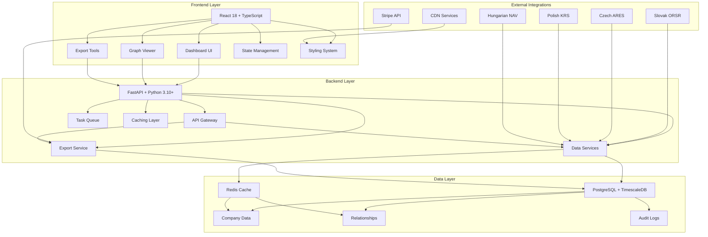
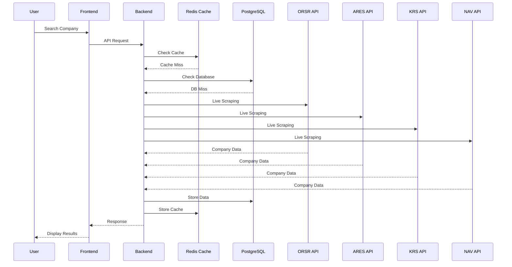
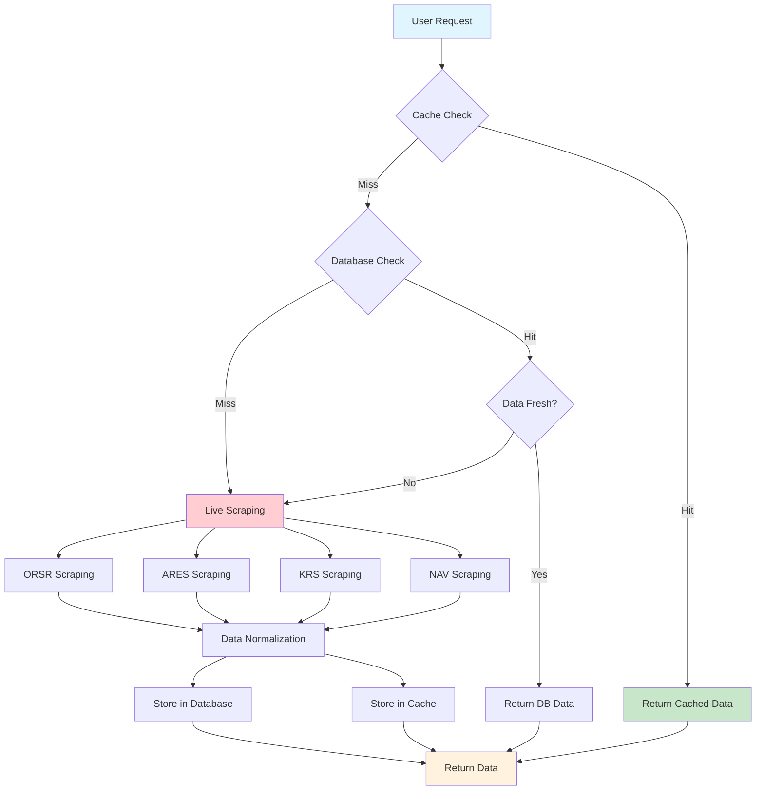
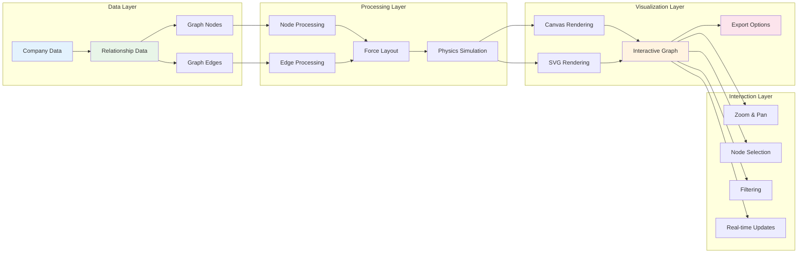
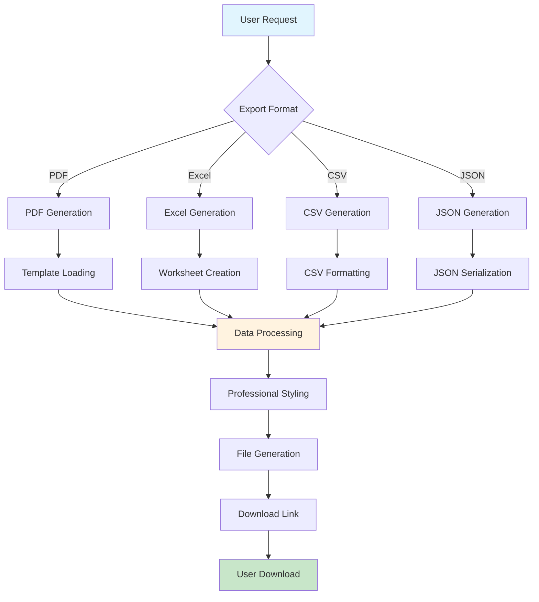
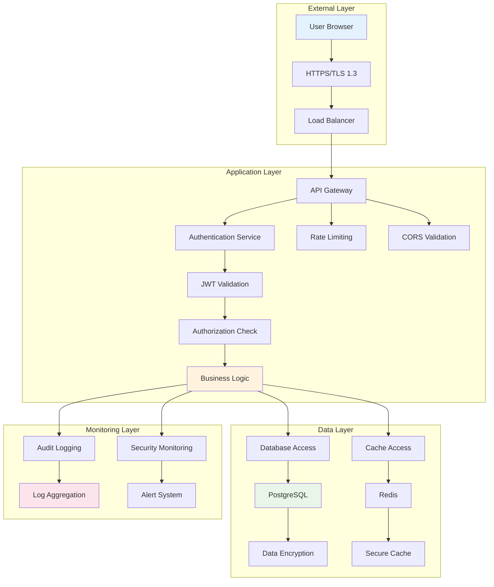
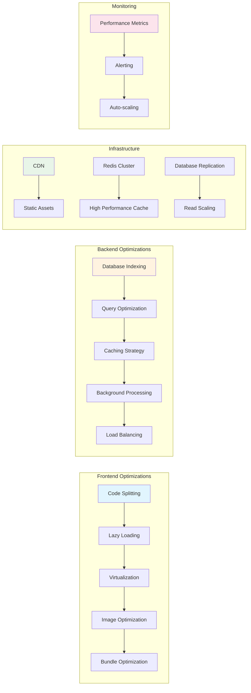

# Mermaid Architecture Diagrams

## System Architecture Overview

## Data Flow Diagram

## Enhanced Data Extraction Pipeline

## Graph Visualization Architecture

## Export Pipeline Architecture

## Security Architecture

## Performance Optimization Architecture

These Mermaid diagrams provide visual representations of the enhanced data extraction and visualization tool architecture, showing the relationships between components, data flows, and system interactions.